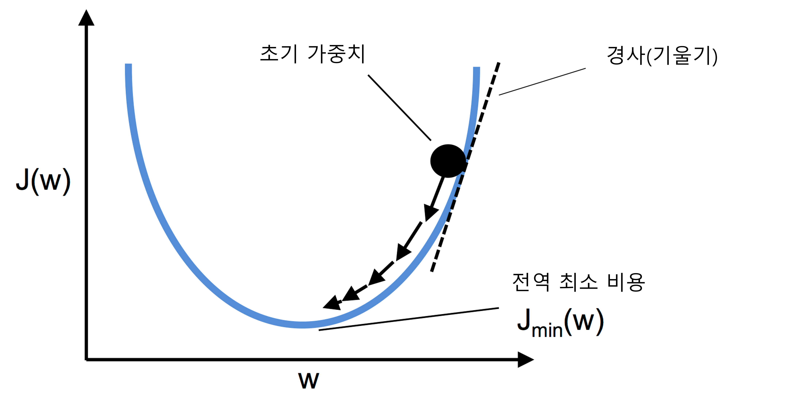

### 특강: 인공 뉴런의 수학적 정의 및 퍼셉트론의 수학적 알고리즘
우리의 수식은 입력값 $\boldsymbol{x}$와 이에 상응하는 가중치 벡터 $\boldsymbol{w}$를 선형 조합하는 데에서 출발합니다.  
$$\boldsymbol{w}=\begin{bmatrix}w_1 \\ \vdots \\ w_m \end{bmatrix}, \boldsymbol{x}=\begin{bmatrix}x_1 \\ \vdots \\ x_m \end{bmatrix}$$  
이 두 벡터의 선형 조합으로 결정 함수 $\phi\left(z\right)$를 정의하죠. 우리의 퍼셉트론, 즉 인공 뉴런에 넣어줄 최종 입력(net input) $z$는 $z=w_1x_1+w_2x_2+\cdots+w_mx_m$입니다. 이제 특정 샘플 $\boldsymbol{x}^{\left(i\right)}$의 최종 입력이 사전에 정의된 임계 값(critical value) $\theta$보다 크면 클래스 1로 예측하고, 그렇지 않으면 클래스 -1로 예측합니다. 퍼셉트론 알고리즘에서 결정 함수 $\phi\left(\cdot\right)$는 단위 계단 함수(unit step function)을 변형한 것입니다.  
$$\phi\left(\cdot\right)=\begin{cases}
1 & z\le\theta\mathsf{\ 일\ 때} \\
-1 & \mathsf{그\ 외}
\end{cases}$$  
식을 단순화하기 위해 임계값 $\theta$를 $z=\theta$라는 식의 좌변으로 옮겨 $w_0=-\theta$이고 $x_0=1$인 0번째 가중치를 정의합니다. 이렇게 하면 $z$를 좀 더 간단하게 쓸 수 있습니다.  
$$z=w_0x_0+w_1x_1+\cdots+w_mx_m=\boldsymbol{w}^T\boldsymbol{x}$$  
그리고 결정 함수도 다음과 같이 바뀝니다.  
$$\phi\left(\cdot\right)=\begin{cases}
1 & z\le 0\mathsf{\ 일\ 때} \\
-1 & \mathsf{그\ 외}
\end{cases}$$  
머신러닝에서는 음수 임계값 또는 가중치 $w_0=-\theta$를 절편이라고 합니다. 여기까지의 과정을 그림으로 나타내면 아래와 같습니다.  
  
이제 가중치를 업데이트하는 부분으로 옮겨가 보겠습니다. 가중치 벡터 $\boldsymbol{w}$에 있는 개별 가중치 $w_j$는 컴퓨터에서 동시에 업데이트한다고 했죠? 이를 수식으로 표현하면 아래와 같습니다.  
$$w_j:=w_j + \Delta w_j,\ \Delta w_j = \eta\left(y^{\left(i\right)}-\hat{y}^{\left(i\right)}\right)x_j^{\left(i\right)}$$  
> <span style="background-color:red">CAUTION</span></br>다른 도서에서는 퍼셉트론 학습 규칙과 나중에 설명할 경사하강법 가중치 업데이트 식의 부호가 이 자료와 다르게 표현되는 경우가 종종 있습니다. 그러니까, $w_j:=w_j - \Delta w_j,\ \Delta w_j = \eta\left(\hat{y}^{\left(i\right)}-y^{\left(i\right)}\right)x_j^{\left(i\right)}$처럼 쓴다는 거죠. 부호의 위치가 바뀌었을 뿐, 식이 의미하는 수학적 의미는 동일하므로 혼동해서는 안 됩니다!  

가중치 벡터의 모든 벡터가 동시에 업데이트되기 떄문에 모든 가중치가 각자의 업데이트 값 $\Delta w_j$에 의해 업데이트되기 전에 예측 레이블 $\hat{y}^{\left(i\right)}$를 다시 계산하지 않습니다. 구체적으로 2차원 데이터셋에서는 다음과 같이 업데이트됩니다.  
$$\Delta w_0 = \eta\left(y^{\left(i\right)}-\mathrm{output}^{\left(i\right)}\right)$$  
$$\Delta w_1 = \eta\left(y^{\left(i\right)}-\mathrm{output}^{\left(i\right)}\right)x_1^{\left(i\right)}$$  
$$\Delta w_2 = \eta\left(y^{\left(i\right)}-\mathrm{output}^{\left(i\right)}\right)x_2^{\left(i\right)}$$  
실제로 이 규칙이 어떻게 작동하는지 알아보겠습니다. 퍼셉트론이 클래스를 올바르게 예측했다면 가중치는 변경되지 않고 그대로 유지됩니다. 따라서 업데이트 값은 0이 됩니다.  
$$y^{\left(i\right)}=-1, \hat{y}^{\left(i\right)}=-1,\ \Delta w_j = \eta\left(-1-\left(-1\right)\right)x_j^{\left(i\right)}$$  
$$y^{\left(i\right)}=1, \hat{y}^{\left(i\right)}=1,\ \Delta w_j = \eta\left(1-1\right)x_j^{\left(i\right)}$$  
잘못 예측했을 때는 가중치를 양성 또는 음성 타겟 클래스 방향으로 이동시킵니다.  
$$y^{\left(i\right)}=1, \hat{y}^{\left(i\right)}=-1,\ \Delta w_j = \eta\left(1-\left(-1\right)\right)x_j^{\left(i\right)}=\eta\left(2\right)x_j^{\left(i\right)}$$  
$$y^{\left(i\right)}=-1, \hat{y}^{\left(i\right)}=1,\ \Delta w_j = \eta\left(-1-1\right)x_j^{\left(i\right)}=\eta\left(-2\right)x_j^{\left(i\right)}$$  
곱셈 계수인 $x_j^{\left(i\right)}$를 좀 더 잘 이해하기 위해 다른 예를 살펴보겠습니다.  
$$\hat{y}^{\left(i\right)}=-1,y^{\left(i\right)}=+1,\eta=1$$  
$x_j^{\left(i\right)}=0.5$일 때 이 샘플을 -1로 잘못 분류했다고 가정합니다. 이때 가중치가 1만큼 증가되어 다음 번에 이 샘플을 만났을 때 최종 입력 $x_j^{\left(i\right)}\times w_j$가 더 큰 양수가 됩니다. 단위 계단 함수의 임계값보다 커져 샘플이 +1로 분류될 가능성이 더 높아질 것입니다.  
$$\Delta w_j=\left(1-\left(-1\right)\right)0.5=\left(2\right)0.5=1$$  
가중치 업데이트는 $x_j^{\left(i\right)}$ 값에 비례합니다. 예를 들어 다른 샘플 $x_j^{\left(i\right)}=2$를 -1로 잘못 분류했다면 이 샘플을 다음 번에 올바르게 분류하기 위해 더 크게 결정 경계를 움직입니다.  
$$\Delta w_j=\left(1-\left(-1\right)\right)2=\left(2\right)2=4$$  
### 특강: 경사 하강법의 수학적 기술 - 아달린을 예시로 함
지도학습 알고리즘의 핵심 구성 요소 중 하나는 학습 과정 동안 최적화히기 위해 정의한 목적 함수(object function)입니다. 아달린은 계산된 출력과 진짜 클래스 레이블 사이의 제곱 오차합(Sum of Squared Errors, SSE)으로 가중치를 학습하기 위한 비용 함수 $J$를 정의합니다.  
$$J\left(\boldsymbol{w}\right)=\frac{1}{2}\sum_i\left(y^{\left(i\right)}-\phi\left(z^{\left(i\right)}\right)\right)^2$$  
$\frac{1}{2}$ 항은 다음 문단에서 설명할 가중치 파라미터에 대한 비용 함수 또는 손실 함수의 그래디언트(gradient)를 간소화하려고 편의상 추가한 것입니다. 단위 계단 함수 대신 연속적인 선형 활성화 함수를 사용하는 장점은 비용 함수가 미분 가능(differentiable)해 진다는 것입니다. 이 비용 함수의 또다른 장점은 볼록 함수라는 것입니다. 간단하지만 강력한 최적화 알고리즘인 경사 하강법을 적용하여 붓꽃 데이터셋의 샘플을 분류하도록 비용 함수를 최소화하는 가중치를 찾을 수 있습니다.  
아래 그림에서는 경사 하강법 이면에 있는 핵심 아이디어를 지역 또는 전역 최소값에 도달할 때까지 언덕을 내려오는 것으로 묘사하고 있습니다. 한 번 반복할 때마다 경사의 반대 방향으로 진행하며, 그 진행의 크기는 경사의 기울기와 학습률로 결정합니다.  
  
경사 하강법을 사용하면 비용 함수 $J\left(\boldsymbol{w}\right)$의 그래디언트 $\nabla J\left(\boldsymbol{w}\right)$ 반대 방향으로 조금씩 가중치를 업데이트할 수 있습니다.  
$$\boldsymbol{w}:=\boldsymbol{w}+\Delta\boldsymbol{w}$$  
가중치 변화량 $\Delta\boldsymbol{w}$는 음수의 그래디언트에 학습률 $\eta$를 곱한 것으로 정의합니다.  
$$\Delta\boldsymbol{w}=-\eta\nabla J\left(\boldsymbol{w}\right)$$  
비용 함수의 그래디언트를 계산하려면 각 가중치 $w_j$에 대한 편도함수를 계산해야 합니다.  
$$\frac{\partial J}{\partial w_j}=-\sum_i\left(y^{\left(i\right)}-\phi\left(z^{\left(i\right)}\right)\right)x_j^{\left(i\right)}$$  
따라서 가중치 $w_j$의 업데이트 공식을 다음과 같이 쓸 수 있습니다.  
$$\Delta w_j=-\eta\frac{\partial J}{\partial w_j}=\eta\sum_i\left(y^{\left(i\right)}-\phi\left(z^{\left(i\right)}\right)\right)x_j^{\left(i\right)}$$  
모든 가중치가 동시에 업데이트되기 때문에 아달린 학습 규칙은 다음과 같습니다.  
$$\boldsymbol{w}:=\boldsymbol{w}+\Delta\boldsymbol{w}$$  
> <span style="background-color:green">Tips and Tricks</span> 제곱 오차합의 도함수</br>미적분에 친숙한 사람들을 위해 $j$번째 가중치에 대한 SSE 비용 함수의 편도함수를 유도하는 과정을 소개합니다.</br>$$\begin{matrix}\frac{\partial J}{\partial w_j} &=& \frac{\partial}{\partial w_j}\frac{1}{2}\sum_i\left(y^{\left(i\right)}-\phi\left(z^{\left(i\right)}\right)\right)^2\\ &=& \frac{1}{2}\frac{\partial}{\partial w_j}\sum_i\left(y^{\left(i\right)}-\phi\left(z^{\left(i\right)}\right)\right)^2 \\ &=& \frac{1}{2}\sum_i 2\left(y^{\left(i\right)}-\phi\left(z^{\left(i\right)}\right)\right)\frac{\partial}{\partial w_j}\sum_i \left(y^{\left(i\right)}-\phi\left(z^{\left(i\right)}\right)\right) \\ &=& \sum_i\left(y^{\left(i\right)}-\phi\left(z^{\left(i\right)}\right)\right)\frac{\partial}{\partial w_j}\sum_i \left(y^{\left(i\right)}-\sum_k\left(w_kx_k^{\left(i\right)}\right)\right) \\ &=& \sum_i\left(y^{\left(i\right)}-\phi\left(z^{\left(i\right)}\right)\right)\left(-x_j^{\left(i\right)}\right) \\ &=& -\sum_i\left(y^{\left(i\right)}-\phi\left(z^{\left(i\right)}\right)\right)\left(x_j^{\left(i\right)}\right)\end{matrix}$$  

아달린 학습 규칙이 퍼셉트론 규칙과 동일하게 보이지만, $z^{\left(i\right)}=\boldsymbol{w}^T\boldsymbol{x}^{\left(i\right)}$인 $\phi\left(z^{\left(i\right)}\right)$는 정수 클래스 레이블이 아니고 **실수**(實數, real number)입니다. 또한, 훈련 데이터셋에 있는 모든 샘플을 기반으로 가중치 업데이트를 계산합니다(각 샘플마다 가중치를 업데이트하지는 않습니다). 이 방식을 **배치 경사 하강법**(batch gradient descent)이라고도 합니다.  
### 특강: 대규모 머신러닝과 확률적 경사 하강법
수백만 개의 데이터 포인트가 있는 매우 큰 데이터셋을 생각해 보죠. 많은 머신러닝 애플리케이션에서 이런 데이터셋은 드문 일이 아닙니다. 이때 배치 경사 하강법을 실행하면 계산 비용이 매우 많이 듭니다. 전역 최소값으로 나아가는 단계마다 매번 전체 훈련 데이터셋을 다시 평가하기 때문입니다.  
**확률적 경사 하강법**(stochastic graident descent)은 배치 경사 하강법의 다른 대안으로 인기가 높습니다. 문헌에 따라서 반복 또는 온라인 경사 하강법이라고도 부릅니다. 다음 첫 번째 수식처럼 모든 샘플 $\boldsymbol{x}^{\left(i\right)}$에 대하여 누적된 오차의 합을 기반으로 가중치를 업데이트하는 대신, 두 번째 수식처럼 각 훈련 샘플에 대해 조금씩 가중치를 업데이트합니다.  
$$\Delta\boldsymbol{w}=\eta\sum_i\left(y^{\left(i\right)}-\phi\left(z^{\left(i\right)}\right)\right)\boldsymbol{x}_j^{\left(i\right)}$$  
$$\Delta\boldsymbol{w}=\eta\left(y^{\left(i\right)}-\phi\left(z^{\left(i\right)}\right)\right)\boldsymbol{x}_j^{\left(i\right)}$$  
확률적 경사 하강법을 경사 하강법의 근사로 생각할 수 있지만, 가중치가 더 자주 업데이트 되기 때문에 수렴 속도는 훨씬 빠릅니다. 반대로, 그래디언트가 하나의 훈련 샘플을 기반으로 계산되므로 오차의 궤적은 배치 경사 하강법보다 훨씬 어지럽습니다. 이 점은 비선형 비용 함수를 다룰 때 얕은 지역 최소값을 더 쉽게 탈출할 수 있어 장점이 되기도 합니다. 이에 대한 내용은 딥러닝 파트로 넘어가서 배우겠습니다.  
확률적 경사 하강법에서 만족스러운 결과를 얻으려면 훈련 샘플의 순서를 무작위로 섞는 것이 중요합니다. 심지어 그 순서가 순환되지 않도록 **매 에포크마다** 훈련 데이터셋을 섞는 것이 좋습니다.  
> <span style="background-color:green">Tips and Tricks</span> 훈련하는 동안 학습률 조정하기</br>확률적 경사 하강법 구현에서 종종 고정된 학습률 $\eta$를 시간이 지남에 따라 적응성 학습률로 대체하곤 합니다. 예를 들어 아래와 같습니다.</br>$$\frac{c_1}{\left[\mathsf{number\ of\ iterations}\right]+c_2}$$</br>여기서 $c_1$과 $c_2$는 상수입니다. 확률적 경사 하강법은 전역 최소값에 도달하지 못하지만 매우 가까운 지역에 근접합니다. 이때 적응성 학습률을 사용하면 최소값에 더욱 가깝게 다가갈 수 있습니다.  

확률적 경사 하강법의 또다른 장점은 **온라인 학습**(online learning)으로 사용할 수 있다는 것입니다. 온라인 학습에서 모델은 새로운 훈련 데이터가 도착하는 대로 훈련됩니다. 많은 양의 훈련 데이터가 있을 때도 유용합니다. 예를 들어 고객 데이터를 처리하는 웹 애플리케이션이 있습니다. 온라인 학습을 사용해서 시스템은 변화에 즉시 적응합니다. 저장 공간에 제약이 있다면 모델을 업데이트한 후 훈련 데이터를 버릴 수 있습니다.  
> <span style="background-color:green">Tips and Tricks</span> 미니 배치 경사 하강법</br>배치 경사 하강법과 확률적 경사 하강법의 절충안이 **미니 배치 학습**(mini-batch learning)입니다. 미니 배치 학습은 훈련 데이터의 작은 일부분으로 배치 경사 하강법을 적용한다고 이해할 수 있습니다. 예를 들어 전체 샘플 중 한 번에 32개만 뽑아서 학습에 사용하는 것이죠. 배치 경사 하강법에 비해 장점은 가중치 업데이트가 더 자주 일어나므로 수렴 속도가 더 빠릅니다. 또 미니 배치 학습은 확률적 경사 하강법에서 훈련 샘플을 순회하는 `for` 반복문을 선형대수 개념(예를 들어 내적(dot product)을 통한 가중치 합 계산)을 사용한 벡터화된 연산으로 바꿔주기 때문에 학습 알고리즘의 계산 효율성이 크게 향상됩니다.  

경사 하강법으로 아달린 학습 규칙을 구현했기 때문에 학습 알고리즘을 조금만 수정하면 확률적 경사 하강법으로 가중치를 업데이트할 수 있습니다. `fit` 메서드 안에서 각 훈련 샘플에 대해 가중치를 업데이트하며 학습합니다. 추가로 `partial_fit` 메서드도 구현하겠습니다. 이 메서드는 가중치를 다시 초기화하지 않아 온라인 학습에서 사용할 수 있습니다. 훈련 후에는 알고리즘이 수렴하는지 확인하려고 에포크마다 훈련 샘플의 평균 비용을 계산합니다. 비용 함수를 최적화할 때 반복적인 순환이 일어나지 않도록 매 에포크가 일어나기 전에 훈련 샘플을 섞는 옵션을 추가합니다. `random_state` 매개변수로는 이 과정을 언제 어디서든 동일한 결과로 재현 가능하도록 랜덤 시드를 지정할 수 있습니다.  
```Python
class AdalineSGD(object):
    """ADAptive LInear NEuron 분류기

    Parameters
    ------------
    eta : float
      학습률 (0.0과 1.0 사이)
    n_iter : int
      훈련 데이터셋 반복 횟수
    shuffle : bool (default: True)
      True로 설정하면 같은 반복이 되지 않도록 에포크마다 훈련 데이터를 섞습니다
    random_state : int
      가중치 무작위 초기화를 위한 난수 생성기 시드

    Attributes
    -----------
    w_ : 1d-array
      학습된 가중치
    cost_ : list
      모든 훈련 샘플에 대해 에포크마다 누적된 평균 비용 함수의 제곱합

    """
    def __init__(self, eta=0.01, n_iter=10, shuffle=True, random_state=None):
        self.eta = eta
        self.n_iter = n_iter
        self.w_initialized = False
        self.shuffle = shuffle
        self.random_state = random_state
        
    def fit(self, X, y):
        """훈련 데이터 학습

        Parameters
        ----------
        X : {array-like}, shape = [n_samples, n_features]
          n_samples 개의 샘플과 n_features 개의 특성으로 이루어진 훈련 데이터
        y : array-like, shape = [n_samples]
          타깃 벡터

        반환값
        -------
        self : object

        """
        self._initialize_weights(X.shape[1])
        self.cost_ = []
        for i in range(self.n_iter):
            if self.shuffle:
                X, y = self._shuffle(X, y)
            cost = []
            for xi, target in zip(X, y):
                cost.append(self._update_weights(xi, target))
            avg_cost = sum(cost) / len(y)
            self.cost_.append(avg_cost)
        return self

    def partial_fit(self, X, y):
        """가중치를 다시 초기화하지 않고 훈련 데이터를 학습합니다"""
        if not self.w_initialized:
            self._initialize_weights(X.shape[1])
        if y.ravel().shape[0] > 1:
            for xi, target in zip(X, y):
                self._update_weights(xi, target)
        else:
            self._update_weights(X, y)
        return self

    def _shuffle(self, X, y):
        """훈련 데이터를 섞습니다"""
        r = self.rgen.permutation(len(y))
        return X[r], y[r]
    
    def _initialize_weights(self, m):
        """랜덤한 작은 수로 가중치를 초기화합니다"""
        self.rgen = np.random.RandomState(self.random_state)
        self.w_ = self.rgen.normal(loc=0.0, scale=0.01, size=1 + m)
        self.w_initialized = True
        
    def _update_weights(self, xi, target):
        """아달린 학습 규칙을 적용하여 가중치를 업데이트합니다"""
        output = self.activation(self.net_input(xi))
        error = (target - output)
        self.w_[1:] += self.eta * xi.dot(error)
        self.w_[0] += self.eta * error
        cost = 0.5 * error**2
        return cost
    
    def net_input(self, X):
        """입력 계산"""
        return np.dot(X, self.w_[1:]) + self.w_[0]

    def activation(self, X):
        """선형 활성화 계산"""
        return X

    def predict(self, X):
        """단위 계단 함수를 사용하여 클래스 레이블을 반환합니다"""
        return np.where(self.activation(self.net_input(X)) >= 0.0, 1, -1)
```